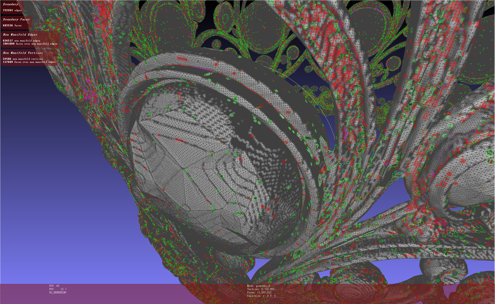

# 20260701 Callback

### 我跑了哪些效果？

Trellis2 自带fill\_hole与simplify函数。我跑了一组带fill\_hole的17组（每组512，1024，1024\_cascade，1536\_cascade \* 4 seed 1536\*1536渲染多视图），还有一组不带fill\_hole的34组（每组512，1024，1024\_cascade，1536\_cascade \* 3 seed 4096\*4096渲染多视图），可视化模式支持simplify到100w个面的mesh在线观看，与同一seed不同分辨率多视图对比。后续分析主要集中在不带fill\_hole的34组，建议以全宽模式阅览（右上角三个点\-页宽设置\-全宽）。

然后我手动打分了前20组数据按照整体（大面积破损，多出细节缺失或模糊），局部（细节模糊，破损面太多）。

### 视觉质量分析：

结论：1536\_cascade 效果目测是人类感官（对比原参考图）最好的，主要原因在于：模型混乱破碎面较少，模型结构较合理。与预测相反的是，细节不一定是最多的。

打分结果：

512 total 1\.70 · 整体 1\.90 · 局部 1\.51 

1024 total 1\.69 · 整体 1\.77 · 局部 1\.60 

1024\_cascade total 1\.84 · 整体 1\.93 · 局部 1\.76 

1536\_cascade total 1\.87 · 整体 1\.93 · 局部 1\.81

以第0个王冠模型为例子：

王冠原图的下方区域因为原图有那种高斯模糊一样的质感，所以是个显著差异的地方，以seed 0 为例子，王冠的下方区域明显较好，有一个框架结构，框架上的装饰也都有。512，1024则是在框架上出现乱七八糟的装饰。1024\_cascade则是没有一个圆环框架，球形浮在空着：

Seed 0

再看seed 1 和 seed 2，只有1536\_cascade噪声显著较少

Seed 1

Seed 2

再看第1个模型砖块，主要关注砖块上的裂纹，seed 0 的512丢失细节，近乎平面，1024的破损严重。对比1024\_cascade，1536\_cascade视觉质量显著提示，裂纹更合理，1024\_cascade存在小突起形态的拓扑错误。 

第12号机器模型，基本都没有遵循原图的三个眼睛，主要关注脑袋后的天线区域，seed 0 1024存在结构破损

类似如下的被折叠后的连接件经常确实，如下图机器人脑袋与天线连接，猪尾巴等

细节呈现上，高分辨率基本上意味着可以承担更多细节，不会出现512这种模糊破损，但是高分辨率不一定会有细节，可能就直接平滑那种，以下图人脸皱纹为例：

人物模型的头发也是，或者多个人物的配饰都会存在结构不连接，遮挡处生成模型想象不足

头发案例：

下图环境mesh主要关注柱子，柱子是由上粗下细的结构，这种在图片上就有的显著差异会被512 1024分辨率给平滑了，变成如下的效果

场景中人物也是，基本上低分辨率完全跑偏了。建筑墙上的人物雕塑四个分辨率都没有做出来，1024甚至直接当作平整的墙面了

锁链与绳子也是低分辨率的重灾区

主要关注书包的绳子

### 其他

整体mesh以法向量方向渲染颜色（浏览器端用 **Three\.js **针对** **camera\-space normal shader 渲染双面颜色），但是可视化中存在很多细碎的小三角形颜色不对，也没有重叠面，不知道为啥法向量是反的

meshlab里单面渲染会有很多面法向量朝向不对：

但是开了 DoubleSide 就不会有这些暗面

浏览器中这种现象则是渲染的则是粉蓝色（法向量朝外）与绿色（法向量朝里），我没搞懂为啥mesh会法向量被判定成法向量突变，我在meshlab里去重叠面也没有，边界边与边界面也检测不到这些暗色的面，没搞懂。

