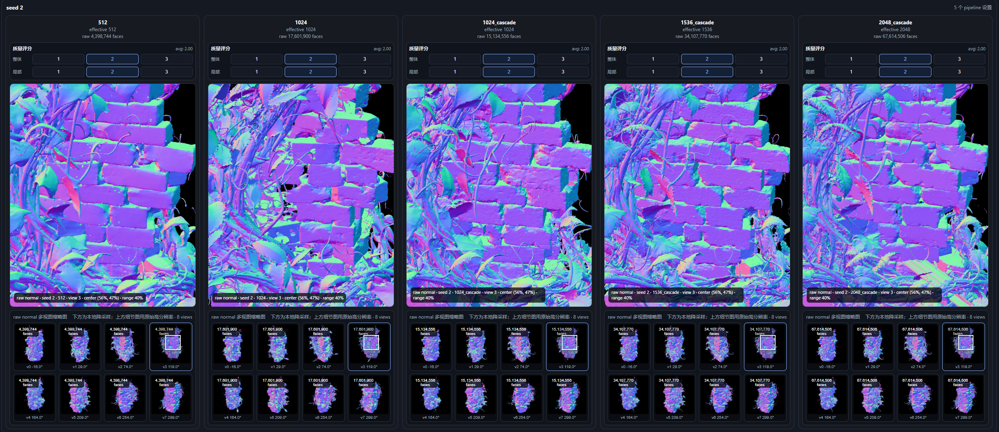

# 20260704 Callback\_0

### 前言

20260704 讨论后，我发现对trellis2 的理解不足，因为pixal3d有基于trellis2的版本，我再仔细看了一下trellis2，第一次实验的时候只考虑了官方默认的512，1024，1024\_cascade，1536\_cascade。对照实现逻辑，唯一不同在于最后交给ldm\+decoder的Slat（coord\(N\*4 激活体素位置\)\+feat（N\*C 激活体素特征））密度不一样，以1024为例，输入的体素密度为64，1536则是96，因此最简单的测试方式应该是尽可能增加体素密度，比如

2048（128），4096（256）。之前担心爆显存（1536就oom了），但是看代码后，对conv 层反推halo ，然后分chunk计算，对mlp，norm直接按token计算，理论上就不存在显存问题。不应该对比由512 引导的1024\_cascade，1536\_cascade，单纯的512，1024是通过图像特征cross attention 找体素激活位置的，级联版本有引导，再推一次，是不公平的。

### 结论：2048细节没有变好，反而多了很多莫名其妙的噪声（不再是碎片，而是已经形成结构），以及错误的拓扑链接，以王冠为例，四个种子都出现相同错误。

对照trellis2的网络设计，从图像到体素的第一步提取coord，最高支持1024（64），但是按照他demo代码级联的设置，是可以通过先对521（32）或1024（64）过ldm然后decoder一次，把解码o\-voxel前一步的高密度（体素坐标\+特征）的体素拿出来，当作coord，再走一遍流程，也就是冒充“图像到体素的第一步提取coord”，然后downsample到比如2048（128）这种，源代码已经给出解法。

因此关键问题还是在最后一步解码器，默认只支持64 grid，按照上述“冒充高密度采样”的方法，去做512（32）引导的2048（128），就会出现如下效果，质量非常差。

### 案例

案例一 四个种子出现了四个2048的拓扑连接显著错误

案例2 除了seed2的“墙面细节被抹平”这个问题，墙缝中的水泥，只有seed3的2048做到了，但其余部分优势不显著

案例3 四个种子出现了三个2048的拓扑连接显著错误

