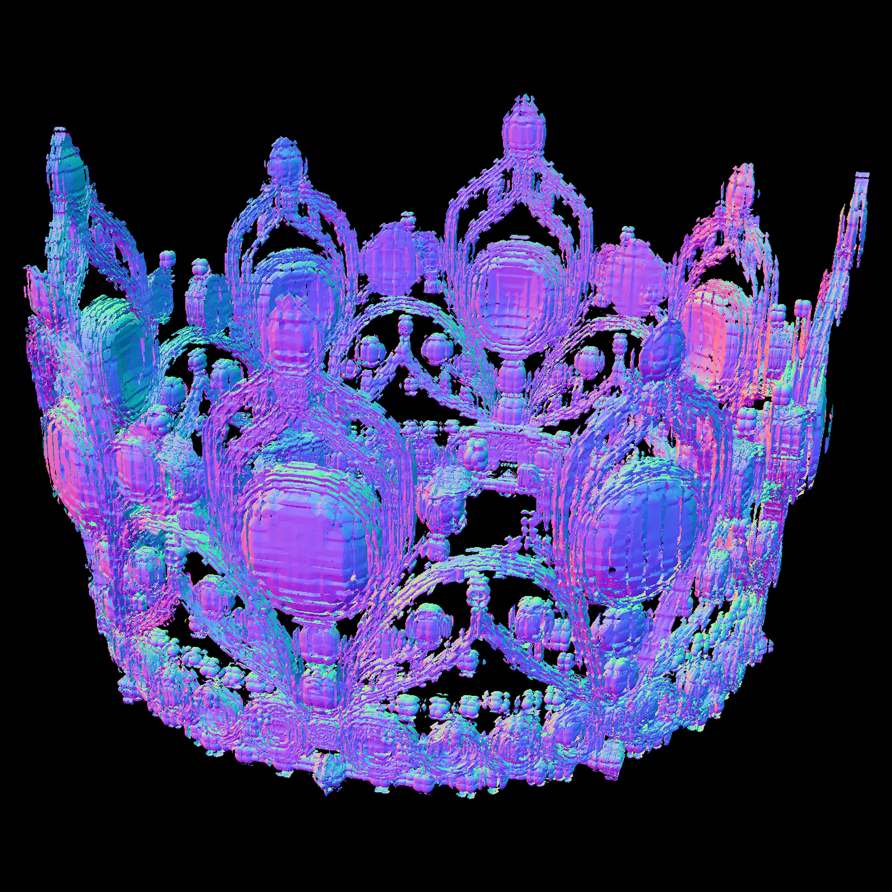

# 20260704 Callback\_1

一直报错的一个点：int32 越界

直接1024 cascade扩展到128 grid，然后走decoder（2048），验证了deocder不支持高分辨率，哪怕是1024搞来的slat

### 2048\_sr

image

→ 图像预处理 / 去背景

→ DINO 分别提取 cond\_512 和 cond\_1024

→ 使用 cond\_512 运行 sparse structure flow

→ 生成 32³ sparse structure coords

本次为 2,870 个 sparse coords，坐标范围 0～31

→ 在 32\-grid coords 上：

使用 512 shape flow \+ cond\_512

→ 采样 LR shape SLat

→ 将 LR SLat 送入 decoder\.upsample\(\.\.\., upsample\_times=4\)

→ Decoder 临时预测更密集的 subdivision support

→ 再量化到 1024 对应的 64³ latent grid

→ 得到 1024 SLat support coords

本次为 13,765 个 64\-grid tokens

→ 在 64\-grid support coords 上：

使用 1024 shape flow \+ cond\_1024

→ 采样稳定的原生 1024 base\_slat

→ base\_slat\.coords ∈ \[0, 63\]

→ base\_slat\.feats 为原生 1024 checkpoint 生成的 SLat features

→ decoder\.upsample\(base\_slat, upsample\_times=1\)

→ 将 64\-grid support 扩展到 128\-grid support coords\_hr

→ 本次：

13,765 base tokens

→ 66,734 HR support tokens

support growth = 4\.848 倍

→ 对每个 128\-grid child coord：

parent\_coord = floor\(child\_coord / 2\)

→ 从对应的 64\-grid base\_slat 复制 parent feature

→ 得到 128\-grid parent\-reference features

→ parent coverage = 1\.0

→ 将 parent features 标准化

→ 按 official t\_start=0\.4 加噪

→ 得到 128\-grid 初始状态 x\_t

→ 执行 2048 SR timestep refinement

本次只运行 2 个 Euler step：

Step 0：

official t = 0\.4 → 0\.230769

Step 1：

official t = 0\.230769 → 0

→ 每个 timestep 都从同一个冻结的全局 x\_t 计算两条 velocity：

① Local velocity

→ 将 128\-grid 空间切成 64³ local windows

→ stride=32，窗口互相重叠

→ 本次共有 24 个非空窗口

→ 每个窗口坐标减去窗口起点，映射到局部 0～63

→ 使用原生 1024 shape flow \+ cond\_1024 预测 velocity

→ 重叠区域使用 cosine 权重融合

→ 得到 v\_local

② Dilated velocity

→ 按 xyz 坐标奇偶性分成 8 个 parity groups

→ 每组坐标执行 floor\(coords / 2\)

→ 128\-grid 间隔采样映射回 64\-grid

→ 使用原生 1024 shape flow \+ cond\_1024 预测 velocity

→ 将 8 组结果写回各自原位置

→ 得到 v\_dilated

→ 融合 velocity：

v\_global = \(1\.0 × v\_local \+ 0\.15 × v\_dilated\) / 1\.15

→ Euler 更新：

x\_prev = x\_t \- \(t \- t\_prev\) × v\_global

→ 2 个 timestep 完成后反标准化

→ 得到最终 128\-grid HR shape\_slat

本次为 66,734 个 tokens

→ 进入 2048 split decoder

→ Decoder global prefix，全局只运行一次：

128\-grid HR SLat

→ from\_latent

→ level 0 全局执行

→ 第一次 subdivision：

128 → 256

66,734 → 396,885 tokens

→ level 1 全局执行

→ 第二次 subdivision：

256 → 512

396,885 → 2,027,428 intermediate tokens

→ 得到完整全局 512\-grid intermediate feature h\_mid

→ 将 512\-grid intermediate space 切成 core：

core\_size = 192

starts = \[0, 192, 384\]

理论上最多 3 × 3 × 3 = 27 个 core

→ 每个非空 core 向外增加 halo=32

→ 从全局 h\_mid 中取出 core \+ halo

→ 坐标转为局部坐标

→ 每块只执行 Decoder suffix：

level 2：

512 → 1024

level 3：

1024 → 2048

→ output head

→ 输出 7\-channel O\-Voxel：

3 个 vertex offset

3 个 intersection logits

1 个 quad split weight

→ halo 只参与卷积上下文

→ 最终只保留当前 core 对应的 O\-Voxel

→ 局部坐标重新映射到全局 2048 grid

→ 将所有 core O\-Voxel 在 CPU 上拼接

→ 检查：

duplicate\_writes = 0

全局坐标唯一

token / face budget 未超限

→ 得到完整全局 2048 O\-Voxel

本次：

35,864,977 O\-Voxel tokens

35,736,854 positive intersections

→ 将完整 O\-Voxel 搬回 GPU

→ 只调用一次：

ovoxel\_to\_mesh\(

global\_ovoxel,

grid\_size=2048

\)

→ Flexible Dual Grid 全局提取 mesh

→ 本次得到：

35,864,977 vertices

71,464,210 faces

→ 使用 normal shader 渲染当前图片

