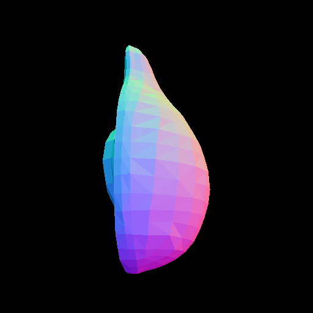
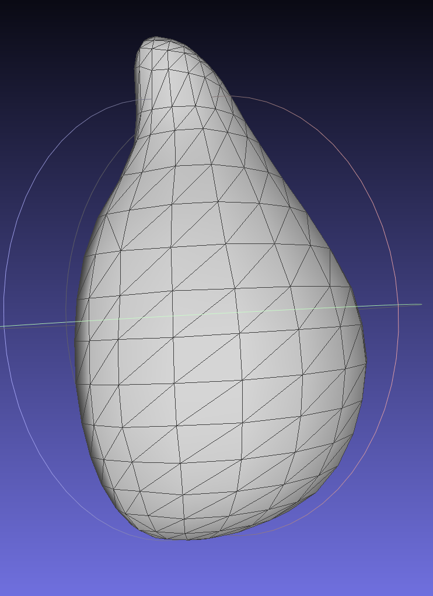

# 20260704 Callback\_2

Re: 

#### Pixal3d的sparse\_structure\_flow 怎么融合noise和cond？

pixal3d：

├─ SS conditioner：DINOv3@512 \+ 16³投影，无 NAF

│    └─ sparse\_structure\_flow \+ decoder

│         └─ 32³ 空间中的 active coords

其中的sparse\_structure\_flow是输入的noise与dino映射到体素的特征（拆分成：全局Dino的前5维度直接用\+局部dino的后1024投影后到体素后使用），通过：

$x←noise+CrossAttn(noise,c_{global})+Wc_{proj}
$

进行特征融合，然后在ldm，在dec得到最开始的32分辨率的支撑体素。

区别于trellis2的

$x←noise+CrossAttn(LN(noise),c(concat(dino_{global},dino_{local}) )$

#### vae重建测试的union指什么？

union 指标指的是算psnr的范围，取两个图都有像素的并集（区别于“silhouette  ”指的是取交集）

silhouette  指标是取交集

#### 不渲染图片计算的psnr等指标是否合理？

VAE重建指标那里全部除以255，所以归一化到0到1了，按通道算psnr这些指标没错的

Texture 全通道 MAE ↓

Texture 全通道 PSNR ↑

Base Color PSNR ↑

Roughness PSNR ↑

Normal PSNR，union ↑

Normal LPIPS ↓

#### vae测试与pixal3d的测试渲染图如何光照？

Pixal3d 多分辨率测试的PBR图接受固定的三个固定方向光\+一个wordl光，gt与生成mesh使用相同的固定光。

vae 那边是两个固定方向光，gt与生成mesh使用相同的固定光。

#### 为啥pixal3d的测试看上去像是简化的mesh？

输入 Avocado\.glb 实际只有 406 顶点、682 面。预测 raw decoder mesh 有 2,027,405 顶点、4,064,542 面。是因为原始mesh就是如此粗糙，生成mesh是在模仿这个样子，其实是个高密度的，可以看其他案例。

因此，还可以得到结论，开会时候说 normal 渲染图的PSNR等指标是有意义的，不存在remesh问题。

### Pixal3d与trellis2的论文流程

Trellis2

输入图像

│

├─ 图像预处理

│    ├─ 有 Alpha：直接使用前景

│    ├─ 无 Alpha：BiRefNet 去背景

│    └─ 裁剪、居中，最长边限制到 1024

│

├─ 共享 Image conditioner：DINOv3 ViT\-L/16

│    ├─ 同一张预处理图像设 image\_size=512

│    │    └─ cond\_512：DINO token sequence，channel=1024

│    │

│    └─ 同一张预处理图像设 image\_size=1024

│         └─ cond\_1024：DINO token sequence，channel=1024

│

│    注意：

│    └─ 所有 sparse tokens 通过 cross\-attention 使用同一组 DINO tokens

│

├─ Sparse Structure conditioner：DINOv3@512

│    └─ 16³ dense Gaussian noise，8 channels \[B, 8, 16, 16, 16\]

│         └─ sparse\_structure\_flow\_model

│              └─ 16³ sparse\-structure latent

│                   └─ sparse\_structure\_decoder

│                        └─ 64³ dense occupancy \[B, 1, Rss, Rss, Rss\]

│                             └─ cascade 路径 max\-pool 64³→32³

│                                  └─ 32³ 空间中的 active coords

│

├─ Shape\-512 阶段

│    ├─ 在 32³ active coords 上创建随机 Gaussian noise

│    │    └─ N\_lr × 32

│    │

│    └─ noise sparse tokens \+ cond\_512

│         └─ shape\_slat\_flow\_model\_512

│              └─ lr\_slat

│                   ├─ coords：32³ active support

│                   └─ feats：N\_lr × 32 shape latent

│

├─ shape\_slat\_decoder\.upsample\(lr\_slat, upsample\_times=4\)

│    └─ 使用 decoder 的 subdivision 分支预测候选 support

│         └─ 输出更密的候选 hr\_coords

│         └─ 坐标重新量化到目标 latent grid

│         └─ unique 去除重复坐标

│              └─ token 数量检查

│                   └─ 最低回退到 1024

│                        └─ hr\_coords\_unique

│

├─ Shape\-HR 阶段

│    ├─ 丢弃 LR shape features

│    ├─ 在 hr\_coords\_unique 上创建全新 Gaussian noise

│    │    └─ N\_hr × 32

│    │

│    └─ noise sparse tokens \+ cond\_1024

│         └─ shape\_slat\_flow\_model\_1024

│              └─ 最终 shape\_slat

│                   ├─ coords = hr\_coords\_unique

│                   └─ feats = N\_hr × 32

│

├─ Texture 阶段

│    ├─ 固定使用最终 shape\_slat\.coords

│    ├─ 在相同 coords 上创建 texture Gaussian noise

│    │    └─ N\_hr × 32

│    │

│    └─ texture noise

│         \+ cond\_1024

│         \+ normalized shape\_slat 作为 concat\_cond

│              └─ tex\_slat\_flow\_model\_1024

│                   └─ tex\_slat

│                        ├─ coords 与 shape\_slat\.coords 相同

│                        └─ feats = N\_hr × 32 texture latent

│

└─ 解码阶段

├─ shape\_slat\_decoder\.set\_resolution\(target\_resolution\)

│

├─ shape\_slat\_decoder\(shape\_slat, return\_subs=True\)

│    ├─ 多级 sparse subdivision / convolution

│    ├─ 输出 O\-Voxel geometry

│    ├─ O\-Voxel → mesh

│    └─ 返回 texture decoder 使用的 guide\_subs

│

├─ tex\_slat\_decoder\(tex\_slat, guide\_subs=shape\_subs\)

│    └─ 输出与 O\-Voxel geometry 对齐的 PBR attributes

│         ├─ base color

│         ├─ metallic

│         ├─ roughness

│         └─ alpha

│

└─ mesh \+ O\-Voxel PBR attributes

└─ MeshWithVoxel / GLB

Pixal3D

输入图像

│

├─ SS conditioner：DINOv3@512 \+ 16³投影，无 NAF

│    └─ sparse\_structure\_flow \+ decoder

│         └─ 32³ 空间中的 active coords

│

├─ Shape\-512 conditioner：DINOv3@512 \+ NAF→512 \+ 32³投影

│    └─ 按 active coords 抽取 N\_lr × 2048 条件

│         └─ shape\_slat\_flow\_model\_512

│              └─ lr\_slat

│

├─ shape\_slat\_decoder\.upsample\(lr\_slat, upsample\_times=4\)

│    └─ 只产生更密的候选 support coords

│         └─ 量化到目标 latent grid：1024→64³，1536→96³

│              └─ unique / token 数量限制

│                   └─ hr\_coords\_unique

│

├─ Shape\-HR conditioner：DINOv3@1024 \+ NAF→512 \+ R³投影

│    └─ 按 hr\_coords\_unique 抽取 N\_hr × 2048 条件

│         └─ 在相同 coords 上创建全新随机 noise

│              └─ shape\_slat\_flow\_model\_1024

│                   └─ shape\_slat

│

├─ Texture conditioner：DINOv3@1024 \+ NAF→1024 \+ R³投影

│    └─ 按 shape\_slat\.coords 抽取 N\_hr × 2048 条件

│         └─ image condition \+ shape\_slat condition

│              └─ tex\_slat\_flow\_model\_1024

│                   └─ tex\_slat

│

└─ shape decoder \+ texture decoder → mesh/PBR

### Pixal3d的多分辨率视觉质量测试

结论：1536 带纹理视觉质量更好，但是增量相对于512\-\>1024，1024\-\>1536增加较少，且法向量稳定性略弱于 1024

### Trellis2 VAE测试

Pixal3d和trellis2的shape\_dec\_next\_dc\_f16c32\_fp16 和 tex\_dec\_next\_dc\_f16c32\_fp16逐字节相同，测试时候看的是trellis2的

结论

几何质量：1024 后基本饱和

纹理质量：随分辨率显著提高

12 个 GLB

× 4 个分辨率：512 / 1024 / 1536 / 2048

× 2 个模式：untiled / tiled

× 3 个 seed

= 288 次运行

### 显存OOM问题

结论：conv修改的对质量没有影响，但是时间成本较大，对显存峰值几乎不影响。后续进一步找，发现decoder峰值显存在最后一个C2S层的layernorm，输入最后一次\*8的token，然后都转fp32，达到显存峰值，这里非常好修改，分chunk即可。

Shape 和 Texture 的 tiled profile 都显示：

calls = 40
tiled\_calls = 40
fallback\_to\_untiled = false

最大完整输入是：3,434,074 tokens

但 tiled 后单个 tile 加 halo 的最大输入只有：11,335 tokens

也就是底层一次 sparse conv 看到的 token 数下降到：

$\frac{11{,}335}{3{,}434{,}074}\approx0.33\%$

Shape与texture decoder的显存峰值发生在最后一个 C2S block 的全分辨率阶段。

Decoder 流程

latent: 36,074 × 32

↓ from\_latent

36,074 × 1024

↓ 4 × ConvNeXt \+ C2S

147,000 × 512

↓ 16 × ConvNeXt \+ C2S

589,161 × 256

↓ 8 × ConvNeXt \+ C2S

2,361,213 × 128

↓ 4 × ConvNeXt \+ C2S\(显存峰值\)

9,450,254 × 64

↓ output layer

shape: 7 channels / texture: 6 channels

$\begin{array}{ccccc}
\hline
\text{C2S level} & \text{Conv} & \text{输入/输出} & \text{Tiled} & \text{Untiled} \\
\hline
0 & \text{conv1} & 36\mathrm{K} \times 1024 \to 36\mathrm{K} \times 4096 & 0.653 & 0.275 \\
0 & \text{conv2} & 147\mathrm{K} \times 512 \to 147\mathrm{K} \times 512 & 0.175 & 0.140 \\
\hline
1 & \text{conv1} & 147\mathrm{K} \times 512 \to 147\mathrm{K} \times 2048 & 0.794 & 0.561 \\
1 & \text{conv2} & 589\mathrm{K} \times 256 \to 589\mathrm{K} \times 256 & 0.353 & 0.281 \\
\hline
2 & \text{conv1} & 589\mathrm{K} \times 256 \to 589\mathrm{K} \times 1024 & 1.265 & 1.124 \\
2 & \text{conv2} & 2.36\mathrm{M} \times 128 \to 2.36\mathrm{M} \times 128 & 0.683 & 0.563 \\
\hline
3 & \text{conv1} & 2.36\mathrm{M} \times 128 \to 2.36\mathrm{M} \times 512 & 2.370 & 2.252 \\
3 & \text{conv2} & 9.45\mathrm{M} \times 64 \to 9.45\mathrm{M} \times 64 & 1.541 & 1.131 \\
\hline
\end{array}$

