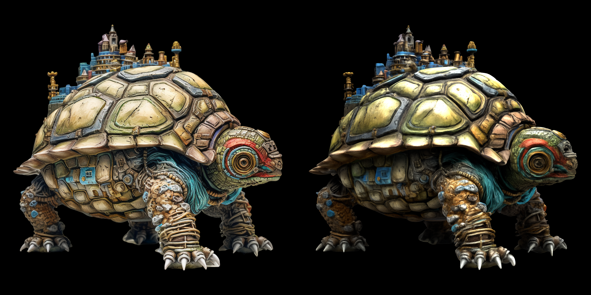

# 20260714\_Callback

根据 20260704 Callback\_2 的结果，可视化质量的理论上界（glb \-\> O\-voxel \-\> Enc \-\> dec \-\>   O\-voxel \-\> glb）\(包含展uv\)

## 未解决问题：

无法对齐global和local的flow 时候的特征。

包含的global dino token不同，所在空间不同，上下文不同，都无法对齐。

激活的点具有稀疏性，点位置不对应就无法继承

## training free 思路

原则为：完全遵循训练模型的要求，只给1024分辨率

### Local 视角： 

Baseline 正常生成到1024 mesh

投影到图上

根据高清图（4096\*4096）切子图（1024\*1024 stride 1024）

子图\-\>拿走自己的 O\-voxel \-\>变换相机视角到子图相机视角

根据local 相机视角内的坐标位置改变索引，变成子图视角的1024 O\-voxel

重新Enc 得到64 slat，记为 **G**

给G加噪，直接对照子图flow\(flow 过程记为 **HR**\)，然后dec到glb，变换坐标到global 相机视角，然后拼接。

因为多视图结果表明，对齐相机视角的质量非超好psnr \+3db，细节纹理都有，但是背后质量极差。

希望G来引导 **HR**，因为都是在local视角的latent，所以是合理的，然后对照1024子图，找到相同位置的从1024\*1024 （baseline用的）切出256\*256子图，对slat保持相同x\_t，重新flow一个当前 **LR。**

大概公式就是v\_t = G \+ HR，然后因为特征没对齐，我还尝试做了CCA变换，就是投影到相关性最高的，但是基本就是回到baseline 的效果

多视图显示结果不可靠，而且slat在不同视角内不同分辨率内（例如global 与 tile）不具备线性关系，类似hiwave的小波变换 保留高频换低频或者 把global slat 先dec 到o\-voxel 然后位置变换，索引坐标变换，然后enc ，相当于把slat变换到local视角下，然后以加权相加，把global 当flow 终点引导 tile路径，修改cross attention（每个token一个 图像特征或这cfg激活）都不行

目前的超分结果：指标显著提升，但是仍有不足

用全局的部分点引导的局部生成：

### Global 视角：

Baselin 生成到 slat 64，准备开始flow

根据高清图（4096\*4096）切子图（1024\*1024 stride 512）

子图\-\>拿走自己的 slat 64 

每一次一步flow就：

全局正常flow G

对照高清子图 的 HR（只看子图内的点，但坐标不变化）

对照低清子图 的 LR（只看子图内的点，但坐标不变化）

v\_t = G \+ \(HR\-LR\)

效果回归到baseline

如果只让baseline局部完全跟着HR走，也会出现多视图非常差。

## 非training free 思路：

Gt glb \-\> Enc \-\> gt slat 64

保持 gt slat 64 的位置，全程在global 相机坐标系内flow，分别对照 1024 global 图（G），1024 子图（HR），256 子图（LR）

目标是把 G 和 HR\-LR 的残差对齐到一个空间上

训练

Delt G = 网络\(G, \(HR\-LR\)\)

结果： Delt G趋近于0

## 代码问题：

xatlas的分块不均衡。（测试阶段不该展uv的，给自己找麻烦）

现在改成最大10000一个chunk的分块，如果原来是一块则保证前后索引连续。

硬阈值导致太密集的网格（面积小于阈值）直接被丢弃。

输入坐标乘了个1024，不会因阈值导致小面片被丢弃。

2048以上分辨率，作dino特征到体素投影时候会因为是dense的网格oom。

改成稀疏体素去proj dino特征

decoder的上采样部分的norm32oom

暂时通过清理其他不用的变量与模型权重避开了

## Baseline 效果

原图：

Pixal3d （左图原图，右图生成studio打光）

