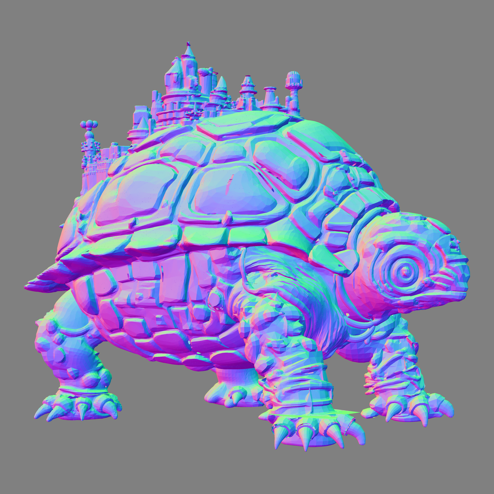
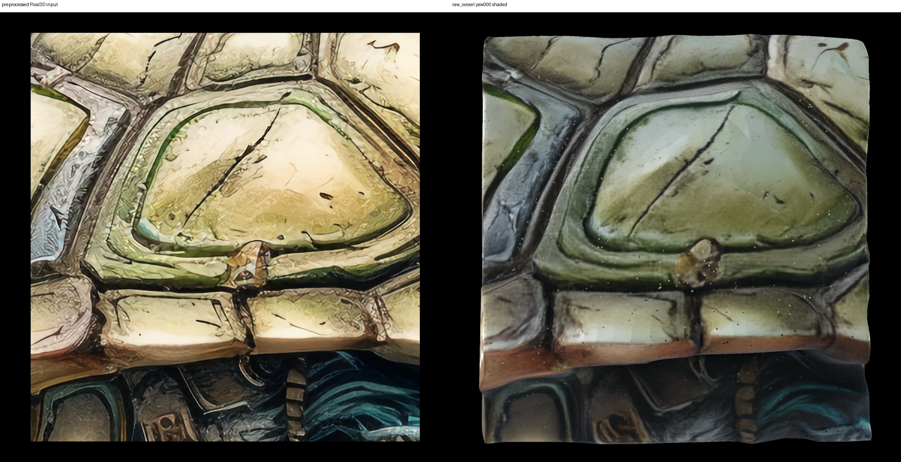

# 20260824\_Callback

## 前言：

目标是构建C256分块推C64，然后实现局部1024分辨率的效果，但是存在**细节不够好**与**整体一致性不足**的问题。为了解决一致性问题，之前采用统一生成C256的方式，也就是baseline生成1024分辨率的mesh，重新voxelize到4096，然后down sample或者Enc下来得到C256。然后统一加噪后分块flow，在latent层面一步一融合。效果依然不够好。

|Baseline 1024|上述 SR 方案（4096）|
|---|---|
|||
|| |

上述 SR 方案（4096）多视图

## 现象：

本次实验发现，单给子图（近似原图1/4大小），然后正常跑baseline流程，实现的效果极好，正是目标的局部效果，经过对比发现，点的**密度差异不大**，怀疑两个问题，一个是**上下文**，一个是**稀疏激活点的具体位置**。

## 结论：

### **上下文不影响正视图质量，但是影响背后不可见区域生成质量。**

因为怀疑比如子图截图太理想了，截取的是完整的乌龟脑袋，所以效果才比较好，于是测试了一下具有迷惑性的乌龟甲壳的一部分，对齐输入视角的部分效果很好，但是背后无法预测对称区域的背甲。

### **激活点位置决定了几何精度**

为了排除上下文与分块推理的影响，手动截取了一个区域的完整乌龟头激活点，但是效果显著差于目标效果。

assets/images/0\_img\.png

→ 普通 Pixal3D\-1024 baseline mesh

→ 用 o\_voxel 重新体素化到 C4096

→ 坐标 floor\(coord4096 / 16\)

→ 去重得到 C256 support

→ 从中截取一个 C64 立方体

然后把这些点平移到局部 \[0,64\)³，执行：

截取全局 C256 的一个 C64 cube

→ 转成局部 C64 support

→ Shape1024 flow（12 steps）

→ C64 → 1024 shape decode

## 简单的尝试

已有全局 C256 support

→ C64/stride32 分块做 Shape1024、Texture1024 velocity

→ 中心 C32 owner 写回全局 latent

→ 最后再按不重叠 C64 分块，各自以 C1024 decode

→ 拼接 mesh

