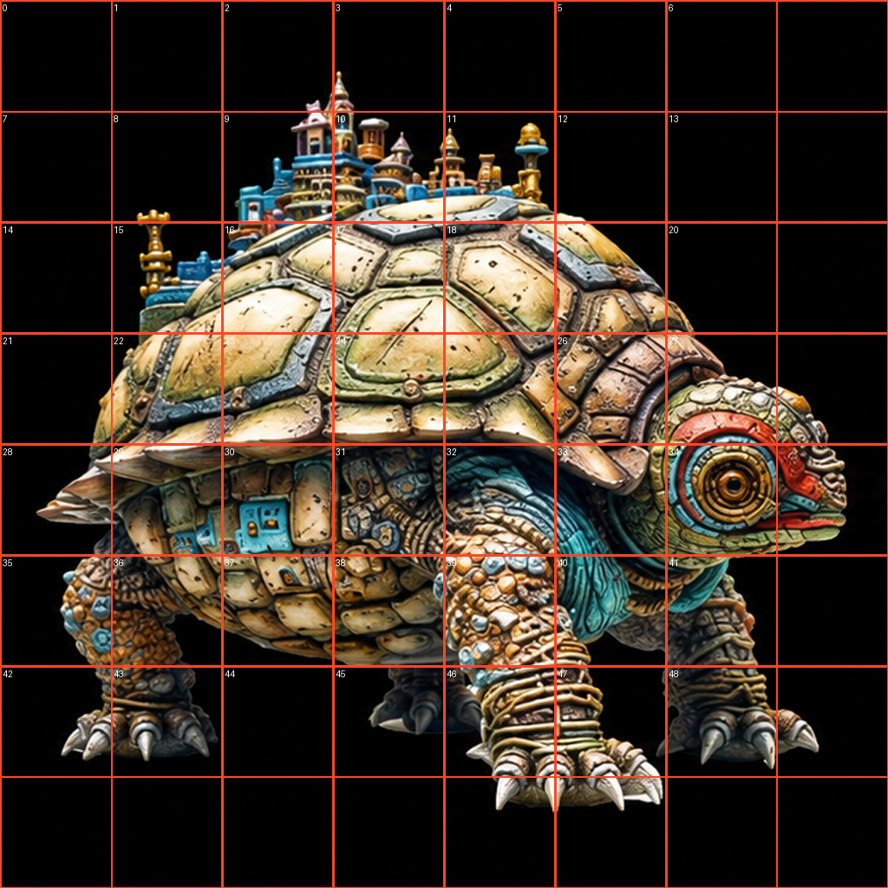

# 20260824\_Callback

# 跨视图跨tile联合flow

## 方案一：维护全局pbr场

目前效果最好的："psnr\_db": 17\.222686633753952（对比baseline的"psnr\_db": 13\.236133211040563）

输入（第一张图是gt输入图，后面两张是拍照baseline 1024生成结果，然后给gpt，让其补充细节生成的）：

方法：local slat \-\> flow 到某一步，直接预测当前步对应的endpoint \-\> dec到pbr \-\> 融合多个pbr \-\> enc回endpoint \-\> 估计当前步的真正速度

## 方案二：维护global稠密slat

但是我觉得更有论文潜力的是："psnr\_db": 17\.482804303281018

local slat \-\> flow 到某一步，直接预测当前步对应的endpoint \-\> 融合多个endpoint  \-\> 估计当前步的真正速度

加入多视图后

## 获取稠密slat的方式（都是对4096\*4096的图按照步长1024 stride512切）

### 方案一：重叠子图的slat是不同的

### 方案二：重叠子图的slat是相同的

