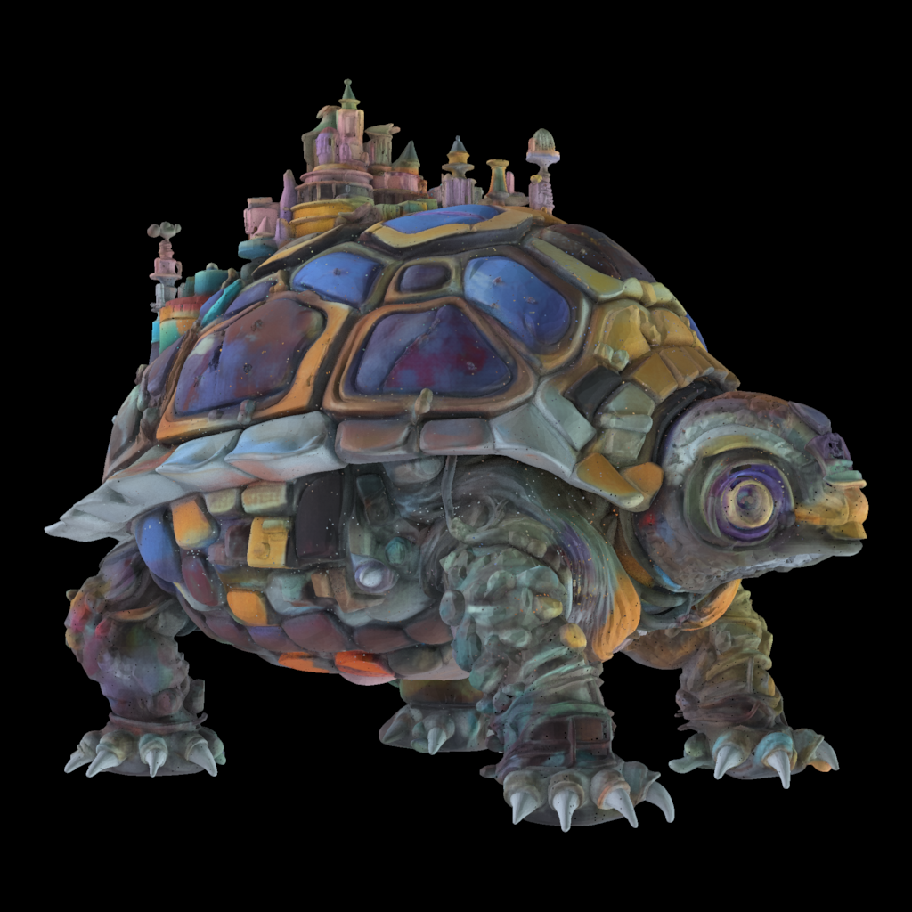

# 20260904

1. 1024分辨率下，从noise开始，uncond生成几何和pbr

2. 1024分辨率下，从一个cond gen的结果加噪开始，之后uncond生成几何和pbr

3. 4096分辨率下，从1024baseline的结果加噪开始，切块后每块uncond生成几何和pbr

    1. 运行 1024 baseline，Texture Flow 改用 12 个均匀时间步。

    2. 保存每一步预测的材质 endpoint。

    3. 使用同一个最终 baseline shape，将 12 个材质 endpoint 分别解码成 1024 O‑Voxel 材质场。

    4. 将该 baseline 几何 voxelize 成 C4096 flexible dual\-grid。

    5. 用官方 shape encoder 下采样，得到统一的 C256 support。

    6. 对每个 C4096 O‑Voxel，从对应的 1024 endpoint O‑Voxel 查询材质。

    7. 使用官方 texture encoder，将每一步的 C4096 材质编码成对应的 C256 texture endpoint。

    8. 在 C256 分块 Texture Flow 中测试 n=1…12：

        - 前 n 步使用对应时间的 C256 endpoint 引导更新。

        - 剩余 12\-n 步使用 image\-unconditional 生成。

        - C256 shape latent 始终保留。

        - context C64、stride C64、batch size 44。

    9. 每组得到全局 C256 texture latent，统一 decode 到 4096。

4. 4096分辨率下，从1024baseline的结果加噪开始，切块后去计算每个块的可见性，然后每块根据可见性分类cond/uncond，生成几何和pbr

5. 4096分辨率下，从1024baseline的结果加噪开始，切块后去计算每个块的可见性（考虑alpha），然后每块根据可见性分类cond/uncond，生成几何和pbr

---

1 是为了看原生的slat gen模型的uncond生成如何。这里是给定sparse structure

2 是为了看原生的slat gen能否保住去噪初始点的信号

3 是加上切块看看有没有什么新问题

4 和5 是不同的可见性计算对结果的影响，要看半透明的粒子

只有材质

